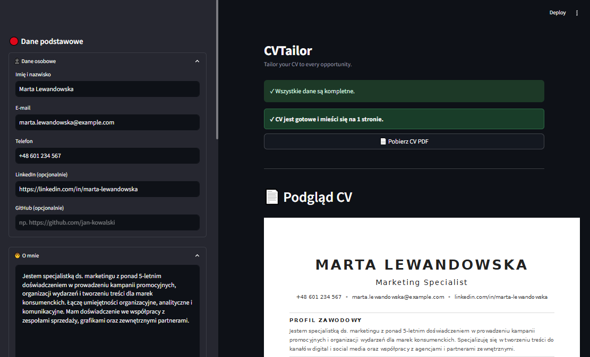
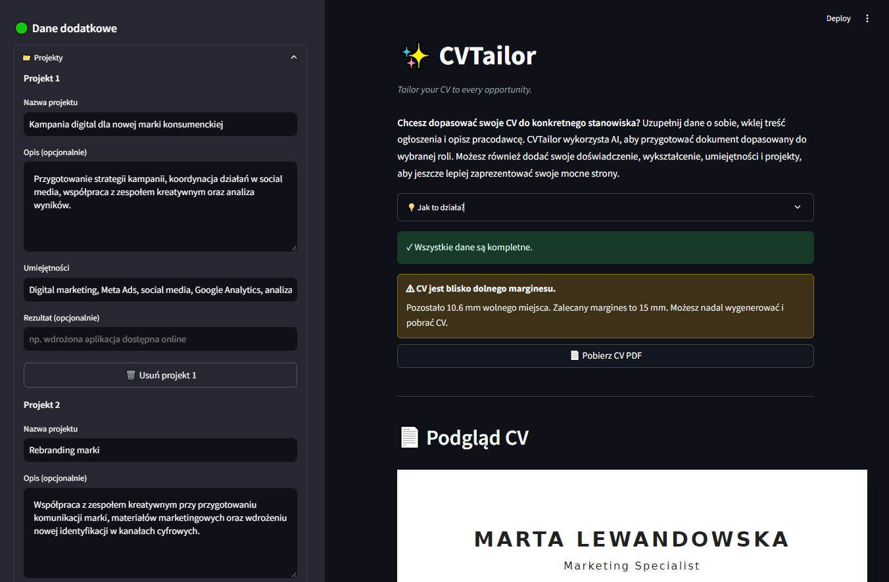
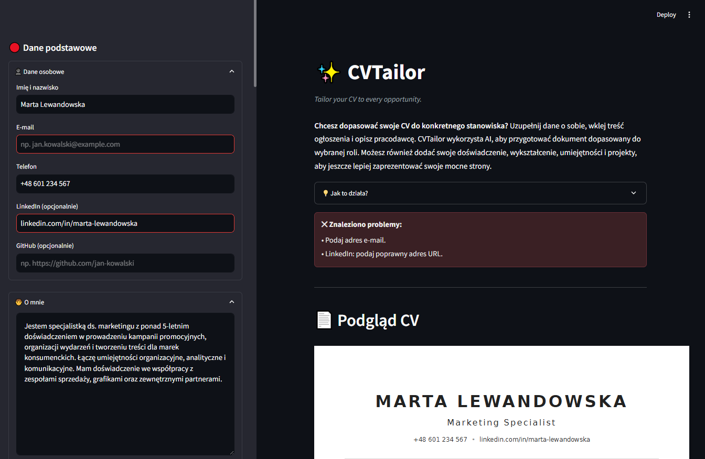
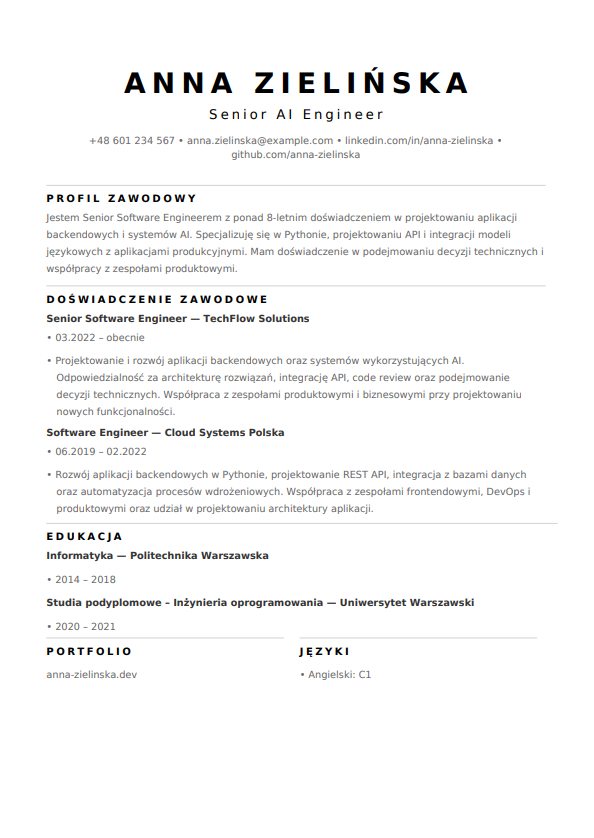
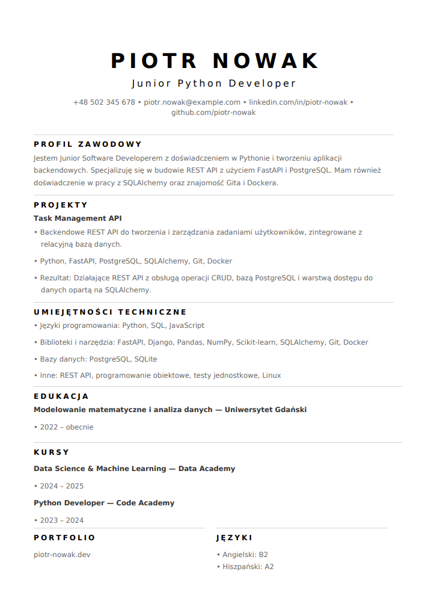
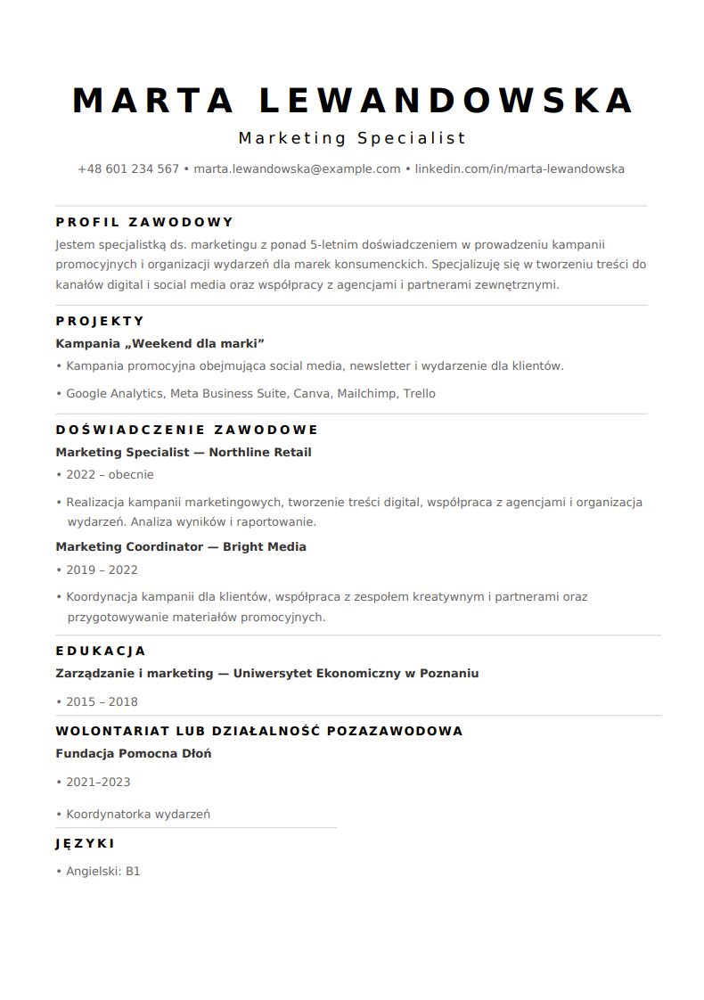

# 📄 CVTailor

An AI-powered Streamlit application for creating professional, job-tailored CVs and generating one-page PDF documents.

CVTailor allows users to enter their professional information, provide a target job offer and company details, and generate a tailored professional profile using the OpenAI API.

The application combines AI-generated content with deterministic PDF generation, input validation, and dynamic document layout.

---

# 🚀 Live Demo

https://cv-tailor-ai.streamlit.app

The application allows users to enter their professional information, validate the provided data, generate a tailored CV, and download the final document as a PDF.

---

# 📸 Screenshots

## Main Application

The main interface guides users through the essential information needed to tailor their CV to a specific job opportunity. Additional professional details can be added optionally.

---

## CV Data and Validation

Users can optionally add their experience, education, skills, projects, languages, portfolio information, and other professional details.

The application validates the provided data and gives feedback when the generated CV requires too much space.

---

## Input Validation

The application validates required fields and prevents CV generation when required information is missing or invalid.

---

## Generated CVs

CVTailor can generate different CV structures depending on the candidate's background and the information provided.

  

  

  

---

# ✨ Features

- Generate job-tailored professional profiles using the OpenAI API
- Enter and manage personal and professional information
- Add projects, education, courses, languages, portfolio, and additional activities
- Validate required input fields
- Validate generated CV length and available page space
- Generate one-page PDF CV documents
- Dynamically adapt the PDF layout to the provided content
- Use custom fonts in generated PDF documents
- Download the generated CV directly from the application
- Manage API credentials through a local `.env` file and Streamlit Secrets
- Deploy the application using Streamlit

---

# 🛠 Tech Stack

- Python 3.11
- Streamlit
- OpenAI API
- ReportLab
- python-dotenv

---

# 🏛 Architecture

The application follows a simple pipeline combining structured user input, AI-generated content, validation, and deterministic PDF generation.

    User
     │
     ├── Personal information
     ├── Professional experience
     ├── Projects
     ├── Education
     ├── Skills
     └── Additional information
     │
     ▼
    Streamlit
     │
     ▼
    Input Validation
     │
     ├── Missing required fields
     └── Invalid input
     │
     ▼
    OpenAI API
     │
     ▼
    Tailored Professional Profile
     │
     ▼
    CV Factory
     │
     ▼
    PDF Generator
     │
     ├── Dynamic layout
     ├── Custom fonts
     └── One-page validation
     │
     ▼
    Generated CV
     │
     ▼
    PDF Download

---

## Main Components

**Streamlit**

Provides the user interface, form handling, validation feedback, CV preview, and PDF download functionality.

**OpenAI API**

Generates a short professional profile tailored to the candidate's background and target job offer.

**CV Factory**

Responsible for constructing the CV content and organizing individual sections such as projects, education, courses, languages, and other information.

**ReportLab**

Generates the final PDF document and handles the document layout.

**Custom Fonts**

DejaVu Sans fonts are included in the project and used when generating the PDF document.

---

# 📁 Project Structure

    .
    ├── app.py
    ├── cv_factory.py
    ├── pdf_generator.py
    ├── requirements.txt
    ├── .gitignore
    ├── README.md
    ├── fonts/
    │   ├── DejaVuSans.ttf
    │   └── DejaVuSans-Bold.ttf
    └── screenshots/
        ├── cv1.PNG
        ├── cv2.PNG
        ├── cv3.PNG
        ├── workflow1.PNG
        ├── workflow2.PNG
        └── workflow3.PNG

---

# 🚀 Installation

Clone the repository:

    git clone https://github.com/Goldmanski/cv-tailor.git
    cd cv-tailor

Create a virtual environment:

    python -m venv .venv

Activate it.

### Windows

    .venv\Scripts\activate

### Linux / macOS

    source .venv/bin/activate

Install dependencies:

    pip install -r requirements.txt

Create a `.env` file containing the required OpenAI API key:

    OPENAI_API_KEY=your_openai_api_key

---

# ▶️ Run

Start the application with:

    streamlit run app.py

The application will open in the browser.

---

# 📄 Example Workflow

1. Enter your personal information.
2. Add a short description of yourself and your professional profile.
3. Provide the target job offer.
4. Add information about the employer and the role.
5. Optionally add your experience, education, skills, projects, languages, portfolio, and other relevant details.
6. Validate the provided information.
7. Generate the tailored CV.
8. Review the generated document.
9. Download the final CV as a PDF.

---

# 🎯 Design Goals

The project focuses on:

- Practical integration of an LLM into a real application
- Structured collection and validation of user data
- Separating AI-generated content from deterministic document generation
- Generating professional one-page PDF documents
- Dynamic document layout
- Handling incomplete and invalid user input
- Building a complete AI-powered application with Streamlit
- Deploying an AI-powered application

---

# 🔮 Possible Future Improvements

- Support for multiple CV templates
- Additional PDF styling options
- More advanced job-description analysis
- More extensive CV content tailoring
- Support for multiple languages
- Persistent user profiles
- CV version management
- Improved ATS optimization
- Additional export formats

---

# 👤 Author

Created by **Eliasz Nowicki** as a portfolio project focused on Python, AI Engineering, LLM integration, Streamlit application development, and automated document generation.